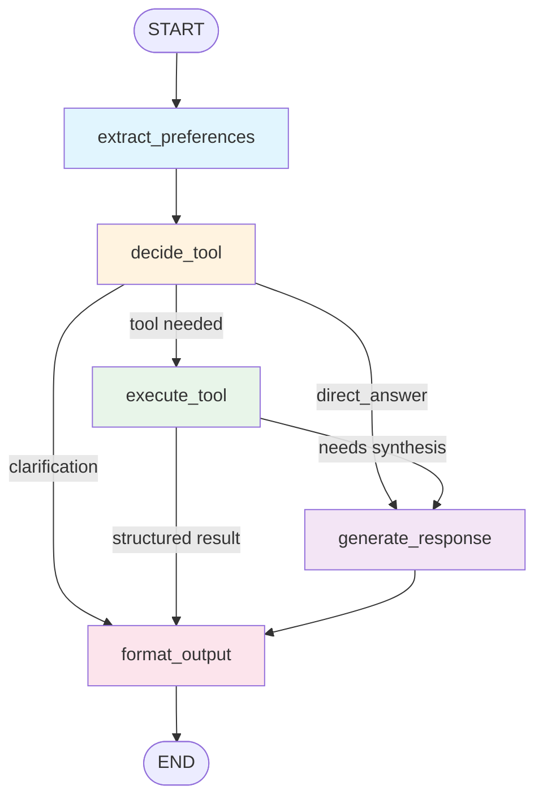

# UK Rent Recommendation System

An AI-powered rental housing recommendation system for international students in the UK. The system combines **RAG (Retrieval-Augmented Generation)**, a **LangGraph StateGraph Agent**, tools served over the **Model Context Protocol (MCP)**, a **layered long-term agent memory**, and **interactive map visualization** to help users find suitable accommodation with personalized, data-driven recommendations over **real, live listing data**.

## Table of Contents

- [Features](#features)
- [System Architecture](#system-architecture)
- [LangGraph Agent Architecture](#langgraph-agent-architecture)
- [Search Experience](#search-experience)
- [Next-generation runtime](#next-generation-runtime)
- [MCP Integration](#mcp-integration)
- [Long-Term Agent Memory](#long-term-agent-memory)
- [Project Structure](#project-structure)
- [Tech Stack](#tech-stack)
- [Getting Started](#getting-started)
- [Configuration](#configuration)
- [Usage](#usage)
- [Module Details](#module-details)
  - [RAG System](#rag-system)
  - [LangGraph Agent](#langgraph-agent)
  - [Tool System](#tool-system)
  - [Data Sources & Scraper](#data-sources--scraper)
  - [Map Visualization](#map-visualization)
  - [Fine-Tuning](#fine-tuning)

## Features

- **Live Property Data** — Real, **city-correct** rental listings scraped from **OnTheMarket on demand** per query, behind a persistent SQLite cache with stale-if-error; when nothing can be retrieved it returns an honest empty result rather than fabricated data
- **Flexible Search — No Fixed Workflow** — The system makes **zero assumptions** about a house hunt. Only a **search area** is required; budget, bedrooms, and commute are all optional. "Where you want to live" and "where you commute to" are separate concepts, and an explicit **"I don't commute"** intent (e.g. *"我不通勤，单纯住着"*) searches with no commute filter
- **Structured Search Form + One-Click Re-Search** — An always-editable criteria panel (and an auto-popup modal when an area is still needed) posts straight to a deterministic search endpoint that **bypasses the LLM router** — so users never get stuck in a clarification loop and can tweak criteria and re-search anytime
- **Semantic Property Search** — FAISS-based similarity matching over property descriptions using SentenceTransformer embeddings
- **Three-Source RAG** — Retrieves and ranks results from property embeddings, conversation history, and area knowledge
- **LangGraph StateGraph Agent** — A graph-based agent with conditional routing, voting-based tool selection, and cross-turn state persistence
- **Tools over MCP** — The agent executes its tools through a **Model Context Protocol** server (stdio); the exact same tools are usable from any external MCP client (e.g. Claude Desktop), with automatic in-process fallback
- **Layered Long-Term Memory** — An LLM-managed memory (episodic / semantic / reflection) synthesizing Generative-Agents scored retrieval, Mem0-style fact extraction & consolidation, and the memory-as-tools pattern — so the assistant remembers a user's budget, destination, and constraints across turns and sessions
- **Interactive Amenity Maps** — Folium/OpenStreetMap-based maps showing nearby amenities (supermarkets, gyms, restaurants, transport) for each property
- **Smart Data Enrichment** — Only fetches safety, amenity, environment, or cost-of-living data when the user's query indicates interest
- **Multi-Source Safety Data** — Crime statistics from the police.uk API with exact numbers
- **Commute Cost Calculator** — Travel time and cost estimation via TfL Journey Planner (free) or Google Maps (optional)
- **Web Search Integration** — DuckDuckGo-based search with authoritative source filtering (gov.uk, Rightmove, Zoopla, BBC)
- **Conversation Memory** — ChromaDB-backed persistent chat history for context-aware follow-up responses
- **Budget-Aware Ranking** — Hybrid scoring (semantic similarity, travel time, budget match, soft preferences) with clear budget violation explanations; **degrades gracefully** — an absent budget or commute constraint simply drops out of the score and filters instead of blocking the search
- **Key-Free by Default** — Geocoding (Postcodes.io / Nominatim), transport (TfL), and POIs (OpenStreetMap Overpass) all run without API keys; the only required key is the LLM provider key

## Next-generation runtime

The Phase 6+ foundations from `NEXT_GEN_AGENT_ARCHITECTURE.md` are implemented in
`src/uk_rent_agent/`. Persistence, contracts, routing, critic, guardrails, and model
routing are integrated with the compatibility graph; the extracted retrieval pipeline
is ready for the planned source-by-source migration:

- SQLite LangGraph checkpoints keyed by `user_id:session_id`, bounded state reducers,
  and durable idempotency keys for write tools.
- Pydantic node/tool contracts, versioned tool envelopes, registry-generated routing
  capabilities, explicit ranking results, and per-source retrieval health/circuit breaking.
- A grounding critic before final formatting, untrusted-content boundaries, tainted-turn
  write restrictions, and per-user memory erasure.
- JSON request-correlated logging, DeepSeek per-node model routes, graph/token SSE event
  translation, and a production ASGI shell.
- Offline intent/retrieval/e2e golden sets, Recall@K/MRR/nDCG metrics, and a CI gate.

Run the server with `uk-rent-web` (now ASGI/uvicorn). Production requires a real
`FLASK_SECRET_KEY`; checkpoints default to `.runtime/checkpoints.sqlite3` and can be
changed with `CHECKPOINT_PATH`. Disable checkpoints only for diagnostics with
`ENABLE_CHECKPOINTER=0`.

Run unit and architecture tests with `python -m pytest -q`. Apply metric floors to a
generated JSON report with `uk-rent-eval-gate report.json`.

## System Architecture

```
User Query (Web UI)
      |
      v
+-------------------+
|   Flask Server     |  (app.py)
|   + Unified UI     |
+--------+----------+
         |
         v
+---------------------------+
| LangGraph Agent            |  StateGraph with conditional routing
| (langgraph_agent)          |  Voting-based tool selection
+----+-------------+--------+
     |             |
     | memory      | tools (execute_tool node)
     v             v
+----------+   +--------------------+
| Agent    |   | MCPToolClient      |  duck-types the tool registry
| Memory   |   | (stdio, bg thread) |  -- fallback --> in-process ToolRegistry
| (Chroma) |   +---------+----------+
+----------+             | stdio (JSON-RPC)
     ^                    v
     |            +--------------------+
     |            | mcp_server.py      |  MCP stdio server
     |            | (uk-rent-tools)    |  reuses create_tool_registry()
     |            +---------+----------+
     |                      |
     |                      v
+------------------------------------------------+
|  Tools + RAG + External APIs & Data            |
|  - OnTheMarket (live listings, hybrid cache)   |
|  - police.uk (crime)                           |
|  - TfL Journey Planner / Google Maps (commute) |
|  - Postcodes.io / Nominatim (geocoding)        |
|  - OpenStreetMap Overpass (amenities)          |
|  - DuckDuckGo (web search)                      |
|  - FAISS (property embeddings)                  |
|  - ChromaDB (conversation + area + memory)      |
+------------------------------------------------+
         ^
         |
+--------+----------+
| DeepSeek API      |  primary LLM (OpenAI-compatible);
| (or local Ollama) |  Ollama optional via LLM_PROVIDER
+-------------------+
```

## LangGraph Agent Architecture

The agent is built as a **LangGraph StateGraph** with five nodes and two conditional routing edges. This replaces the previous custom ReAct loop with a cleaner, more maintainable graph-based architecture.

### Graph Flow Diagram



### Node Descriptions

| Node | Purpose |
|---|---|
| **extract_preferences** | Parses the user message for hard/soft preferences, excluded areas, required amenities, and lifestyle signals |
| **decide_tool** | Maps the query to a tool. Deterministic fast-paths handle unambiguous intents first (memory recall, follow-ups over existing results, live-transport questions, and an **"I don't commute" → search** shortcut) before falling back to LLM classification with heuristic tie-breaking — so a clear tool request routes straight to that tool |
| **execute_tool** | Dispatches to the tool provider (MCP client, with in-process fallback); injects accumulated search criteria (`area`, `commute_destination`, `no_commute`, `bedrooms`, budget) for `search_properties`; supports multi-search parallel execution |
| **generate_response** | LLM synthesizes a final answer from tool observations using the Alex persona prompt templates |
| **format_output** | Structures the response for the frontend — sets `response_type`, formats safety/POI/commute data, applies preference filters |

### Routing Logic

```
After decide_tool:
  direct_answer  --> generate_response  (greetings, simple questions)
  clarification  --> format_output      (missing information)
  any tool       --> execute_tool       (needs external data)

After execute_tool:
  structured results (safety/POI/commute/property found) --> format_output
  needs LLM synthesis (web_search, reasoning_property)   --> generate_response
```

### State Schema

```python
class AgentState(TypedDict):
    user_query: str                          # Current user message (with history + injected memory)
    extracted_context: Dict[str, Any]        # Property context from UI (+ current_message)
    user_preferences: Dict[str, List[str]]   # Accumulated preferences
    accumulated_search_criteria: Dict        # Cross-turn search criteria
    tool_decision: Dict[str, Any]            # Selected tool + params
    tool_observation: Optional[str]          # Tool execution result (text)
    tool_raw_data: Optional[Any]             # Tool execution result (structured)
    final_response: str                      # Final response text
    response_type: str                       # answer | question | clarification
    tool_data: Dict[str, Any]                # Structured data for frontend
```

`accumulated_search_criteria` carries the cross-turn search state with canonical keys — `area`, `commute_destination` (mirrored to a legacy `destination`), `no_commute`, `bedrooms`, `max_budget`, `max_travel_time`, `budget_period` — plus accumulated `property_features` / `soft_preferences`.

## Search Experience

Property search deliberately encodes **no fixed workflow** — the system never assumes a house hunt has to start with a destination, a budget, and a commute time. It works with whatever the user has given and degrades gracefully.

### Design principles

- **Only an area is required.** Budget, bedrooms, and commute are all optional. A missing budget searches a wide price band; a missing commute simply applies no commute filter.
- **Area ≠ commute destination.** *Where you want to live* (`area`) and *where you commute to* (`commute_destination`) are distinct. A university named as a destination (e.g. `UCL`) also implies a sensible search area (Bloomsbury); an area named on its own (`Camden`) needs no commute target at all.
- **Explicit "no commute" intent.** Messages like *"I just want to live there / work from home"* or *"我不通勤，单纯住着"* set `no_commute` and search with the commute logic fully disabled — the model never asks "where do you commute to?" again.
- **Ask once, only for the area.** The single clarification the search can emit is *"which area would you like to live in?"* — and only when no area is resolvable. It is language-aware (Chinese question for a Chinese message) and never loops on budget or commute.
- **Typo/glued-token tolerance.** Location resolution falls back to a substring match, so a glued token like `axocamden` still resolves to Camden.

### Two entry points

| Path | How it works |
|---|---|
| **Conversational** (`POST /api/alex`) | Natural-language messages flow through the LangGraph agent. When only the area is missing, the response carries a structured `missing_fields` / `known_criteria` payload instead of an open-ended question. |
| **Direct / form** (`POST /api/search_direct`) | The frontend's criteria form posts structured criteria straight to the search tool, **bypassing the LLM router** entirely — deterministic, fast, and immune to extraction ambiguity. |

### Frontend

The right-hand panel hosts an **always-editable "Search criteria" card** (area, budget + period, bedrooms, commute destination + max minutes, and an *"I don't commute"* toggle). The **same form auto-opens as a modal** whenever the agent still needs an area, pre-filled with whatever is already known. Users can adjust any field and **re-search with one click** at any time. Both the conversational and direct paths share and persist the same per-conversation criteria, so the form, the chat, and the accumulated state stay in sync. Fully bilingual (EN/ZH).

## MCP Integration

The agent's tools are exposed over the **Model Context Protocol** by `mcp_server.py`, and the LangGraph agent consumes them through that server over **stdio**. This means the exact same tools the in-process agent uses are also usable by any external MCP client (e.g. Claude Desktop) — one implementation, two consumers.

### Architecture

```
LangGraph agent (execute_tool node)
      |  await tool_provider.execute_tool(name, **params)
      v
core/mcp_client.py  MCPToolClient ----- duck-types ToolRegistry.execute_tool
      |  stdio (persistent background event-loop thread)   -- fallback --> in-process ToolRegistry
      v
mcp_server.py  (MCP stdio server "uk-rent-tools")
      |  reuses core.tool_system.create_tool_registry()    <- single source of truth
      v
core/tools/*  (the tool implementations)
```

### How it works

- **Single source of truth** — `mcp_server.py` builds the registry with `create_tool_registry()` and advertises every registered tool (the domain tools **plus** the two memory tools) using each tool's existing OpenAI-format JSON schema. The web app and the MCP subprocess therefore share one tool implementation.
- **Duck-typed client** — `MCPToolClient` implements only the one method the agent calls on a registry, `async execute_tool(name, **kwargs) -> ToolResult`. So `build_agent_graph(provider)` works unchanged whether it's handed the MCP client or the raw registry.
- **Background event-loop thread** — An MCP stdio `ClientSession` is bound to the event loop it was created in, but Flask runs each async request in its own loop. The client owns the session in a dedicated background loop thread and bridges calls with `run_coroutine_threadsafe`, so requests from any loop work.
- **Transparent fallback** — If the server is unavailable or a call fails, the client falls back to the in-process `ToolRegistry`, so the app keeps working even if MCP is down.
- **Clean stdio protocol** — MCP speaks JSON-RPC over stdout; the server redirects all diagnostic `print()` output to (UTF-8) stderr so it never corrupts the protocol channel (and never crashes on a non-UTF-8 Windows console).

### Result envelope

`call_tool` returns the project's `ToolResult` shape as a JSON text envelope, which the client parses back losslessly:

```json
{"success": true, "data": <tool data>, "error": null,
 "tool_name": "check_safety", "execution_time_ms": 812.4}
```

### Running

The web app wires MCP automatically at startup — it builds the in-process registry, starts an `MCPToolClient` (which spawns `python mcp_server.py` over stdio), and hands it to the agent. To force the old in-process path instead:

```bash
USE_MCP_TOOLS=0 python app.py
```

Run the MCP server standalone (speaks MCP over stdio):

```bash
cd local_data_demo
python mcp_server.py
```

Register it in an external MCP client (e.g. Claude Desktop):

```json
{
  "mcpServers": {
    "uk-rent-tools": {
      "command": "<path-to-python>",
      "args": ["mcp_server.py"],
      "cwd": "<repo>/local_data_demo"
    }
  }
}
```

> See `local_data_demo/MCP.md` for the full integration notes.

## Long-Term Agent Memory

Beyond the per-conversation history, the assistant has a **persistent, LLM-managed long-term memory** (`rag/agent_memory.py`) so it remembers stable facts about a user — their budget, target university/destination, hard constraints, and areas to avoid — across turns **and across sessions**. It is a synthesis of the recent agent-memory literature.

### Memory types (CoALA taxonomy)

| Type | What it stores |
|---|---|
| **episodic** | Individual interaction records (what the user asked, which tool was used) |
| **semantic** | Distilled, durable facts about the user (budget, destination, constraints) |
| **reflection** | Higher-level insights synthesized from episodic memories (a semantic subtype) |

Working/short-term memory stays in the agent's context window and is not stored here.

### How it works

- **Scored retrieval (Generative Agents, Park 2023)** — On each turn the top-K candidates are fetched by embedding similarity, then re-ranked by `relevance + recency + importance`, each min-max normalized to [0,1]. Recency decays as `0.995^hours_since_last_access`; importance is an LLM 1–10 "poignancy" rating cached at write time. The top memories are formatted and injected into the prompt before the agent runs.
- **Write path (Mem0, 2025)** — After each turn (in a **background thread**, so it never blocks the response): an LLM extracts atomic facts from the exchange, then an LLM decides **ADD / UPDATE / DELETE / NOOP** for each fact against the semantically-nearest existing memories — handling dedup and conflict resolution — guarded by an MD5 exact-duplicate check.
- **Reflection** — When accrued importance crosses a threshold, the system distills recent memories into 1–3 higher-level insights about what the user really wants.
- **Memory-as-tools (Letta / LangMem)** — Memory is also exposed as two tools, `recall_memory` and `remember`, registered in the same tool registry. So the agent (and, via MCP, any sub-agent or external client) can read and write memory explicitly, namespaced by `user_id` / `session_id`.

### Storage

ChromaDB (persistent, cosine) — a single `agent_memory` collection with the memory type kept in metadata, stored at `local_data_demo/chroma_db_agent_memory/`. The **same on-disk store is shared** by the web process and the MCP tool subprocess, so memory written in one is visible to the other. LLM calls go through `core.llm_interface`, which uses the configured provider (DeepSeek by default).

### Where it plugs in

```
/api/alex request
  -> retrieve(user_message)            # GA-scored; injected into the prompt
  -> agent_graph.ainvoke(state)        # agent may also call recall_memory / remember
  -> respond to user
  -> remember_turn_async(...)          # background: extract -> consolidate -> maybe_reflect
```

## Project Structure

```
uk_rent_recommendation/
|
+-- local_data_demo/              # Main application
|   +-- app.py                    # Flask server entry point (wires MCP + memory)
|   +-- mcp_server.py             # MCP stdio server exposing the agent's tools
|   +-- config.py                 # API key & provider configuration
|   +-- MCP.md                    # MCP integration notes
|   +-- unified-ui.html           # Web interface (Alex UI)
|   +-- requirements.txt          # Python dependencies
|   +-- data/
|   |   +-- fake_property_listings.csv      # Bundled sample data (final fallback)
|   |   +-- scraped_property_listings.csv   # Live scraped cache (created at runtime)
|   +-- core/                     # Core modules
|   |   +-- langgraph_agent.py    # LangGraph StateGraph agent (main)
|   |   +-- mcp_client.py         # MCPToolClient (stdio) with in-process fallback
|   |   +-- llm_config.py         # Centralized LLM config (DeepSeek / Ollama)
|   |   +-- llm_interface.py      # LLM interface used by tools & memory
|   |   +-- tool_system.py        # Tool registry & execution framework
|   |   +-- maps_service.py       # Geocoding (Postcodes.io/Nominatim), TfL, crime
|   |   +-- location_service.py   # Location identifier resolution + caching
|   |   +-- cache_service.py      # Generic on-disk cache
|   |   +-- enrichment_service.py # Conditional data enrichment
|   |   +-- cuisine_classifier.py # Restaurant cuisine classification
|   |   +-- web_search.py         # DuckDuckGo search integration
|   |   +-- data_loader.py        # CSV data loading & parsing
|   |   +-- amenity_map_generator.py  # Interactive map generation
|   |   +-- user_session.py       # Session & favorites management
|   |   +-- scraping/             # Real-scraper integration layer
|   |   |   +-- on_demand.py       # Live search path: on-demand scrape + SQLite cache + slug resolution
|   |   |   +-- onthemarket.py     # OnTheMarket scraper (working live source)
|   |   |   +-- provider.py       # Startup dataset: hybrid cache + scrape + fallback
|   |   |   +-- openrent.py       # OpenRent scraper (legacy stub, endpoint dead)
|   |   |   +-- rightmove.py      # Rightmove stub (endpoint dead / ToS-barred)
|   |   |   +-- zoopla.py         # Zoopla scraper (separate anti-bot setup)
|   |   |   +-- normalize.py      # Scraper output -> project schema
|   |   |   +-- config.py         # Sources, search tasks, cache TTL
|   |   +-- tools/                # Tool implementations
|   |       +-- search_properties.py       # Property search (over live data)
|   |       +-- calculate_commute_cost.py  # Travel time + cost calculation
|   |       +-- calculate_commute.py       # Basic commute time
|   |       +-- check_transport_cost.py    # Transport cost estimation
|   |       +-- check_safety.py            # Crime statistics lookup
|   |       +-- search_nearby_pois.py      # Nearby amenities search
|   |       +-- get_property_details.py    # Full property information
|   |       +-- get_weather.py             # Weather information
|   |       +-- web_search.py              # General web search
|   |       +-- memory_tools.py            # recall_memory / remember (memory-as-tools)
|   +-- rag/                      # RAG + memory
|   |   +-- property_embeddings.py   # FAISS + SentenceTransformer
|   |   +-- rag_coordinator.py       # Multi-source hybrid ranking
|   |   +-- conversation_memory.py   # ChromaDB conversation history
|   |   +-- area_knowledge.py        # London area knowledge base
|   |   +-- agent_memory.py          # Layered long-term agent memory
|   +-- scripts/
|       +-- prefetch_osm_data.py  # Pre-fetch OSM POIs for known areas
|
+-- map_visualization/            # Standalone map generator
|   +-- property_amenity_map.py   # Folium map with OSM amenities
|   +-- coordinate_verifier.py    # Geocoding accuracy verification
|   +-- get_google_coordinate.py  # Google Geocoding integration
|
+-- fine_tuning/                  # Model fine-tuning pipeline
|   +-- generate_data.py          # Training data generation
|   +-- train_model.py            # LoRA fine-tuning
|   +-- evaluate_model.py         # Model evaluation
|   +-- production_extractor.py   # Production inference
|   +-- student_model_lora/       # Fine-tuned LoRA adapter weights
|
+-- scrapped_data_demo/           # Legacy demo (web scraping version)
|   +-- app.py
|   +-- ollama_interface.py
|   +-- scrapper/                 # Rightmove & Zoopla scrapers
|
+-- tests/                        # Test files
```

## Tech Stack

| Category | Technologies |
|---|---|
| **Backend** | Flask, Python 3.10+ |
| **Agent Framework** | LangGraph (StateGraph), LangChain |
| **LLM** | DeepSeek API (OpenAI-compatible, default) via LangChain-OpenAI; Ollama (local, optional) via LangChain-Ollama |
| **Tool Protocol** | Model Context Protocol (MCP) over stdio (Python `mcp` SDK) |
| **Vector Database** | ChromaDB (conversation, area knowledge, agent memory) |
| **Embeddings** | SentenceTransformer (`all-MiniLM-L6-v2`) |
| **Similarity Search** | FAISS (`IndexFlatIP` — cosine similarity) |
| **Geocoding** | Postcodes.io, OpenStreetMap Nominatim (no key) |
| **Transport / Commute** | TfL Journey Planner (free), Google Maps / OpenRouteService (optional) |
| **POIs / Amenities** | OpenStreetMap Overpass (no key), Folium, Leaflet |
| **Listing Data** | OnTheMarket scraper with hybrid TTL cache |
| **Web Search** | DuckDuckGo (DDGS) |
| **Data Processing** | Pandas, NumPy, Scikit-learn |
| **ML / NLP** | PyTorch, Transformers, Sentence-Transformers |
| **Fine-Tuning** | LoRA (PEFT), Hugging Face Transformers |
| **Frontend** | HTML5, CSS3, JavaScript |

## Getting Started

### Prerequisites

- Python 3.10+
- A **DeepSeek API key** (default LLM provider) — or [Ollama](https://ollama.com/) installed and running if you prefer local inference
- Git

### Installation

1. **Clone the repository**

   ```bash
   git clone https://github.com/<your-username>/uk_rent_recommendation.git
   cd uk_rent_recommendation
   ```

2. **Install dependencies**

   ```bash
   conda activate uk_rent
   pip install -e .
   ```

3. **Set up environment variables**

   Create a `.env` file in `local_data_demo/`:

   ```env
   # --- LLM provider ---
   LLM_PROVIDER=deepseek                        # 'deepseek' (default) or 'ollama'
   DEEPSEEK_API_KEY=your_deepseek_key           # required when LLM_PROVIDER=deepseek
   DEEPSEEK_BASE_URL=https://api.deepseek.com   # optional override
   DEEPSEEK_MODEL=deepseek-chat                 # optional override

   # --- Optional: local LLM instead of DeepSeek ---
   OLLAMA_BASE_URL=http://localhost:11434
   OLLAMA_MODEL=gemma3:27b-cloud

   # --- Optional: paid/extra map services (free providers work without keys) ---
   GOOGLE_MAPS_API_KEY=your_google_maps_key     # optional, more accurate travel times
   OPENROUTESERVICE_API_KEY=your_ors_key        # optional free alternative
   TFL_APP_KEY=your_tfl_key                      # optional, raises TfL rate limits

   # --- Optional toggles ---
   FLASK_SECRET_KEY=replace-with-a-long-random-value
   USE_MCP_TOOLS=0                              # default: fast in-process tools; set 1 for MCP
   SCRAPER_SOURCES=onthemarket                  # comma-separated scraper sources
   SCRAPER_CACHE_TTL_HOURS=24                   # how long the live cache stays fresh
   ```

   If using Ollama instead, pull a model first:

   ```bash
   ollama pull gemma3:27b
   ```

4. **Run the application**

   ```bash
   conda activate uk_rent
   python -m uk_rent_agent.web
   ```

   Open your browser and navigate to `http://localhost:5001`.

## Configuration

**LLM provider** — selected via `LLM_PROVIDER` and configured in `local_data_demo/core/llm_config.py`:

```python
LLM_PROVIDER = "deepseek"   # 'deepseek' (cloud, OpenAI-compatible) or 'ollama' (local)
```

Per-task LLM factories are defined there: `get_react_llm` (low temperature, response generation), `get_classification_llm` (higher temperature, tool-selection voting), and `get_planning_llm` (higher temperature, search planning).

**Travel-time service** — `local_data_demo/config.py`:

```python
# Travel time service: 'google' (accurate, paid) or 'openroute' (free, approximate).
# Note: the default map stack uses free providers (TfL / Postcodes.io / Nominatim /
# Overpass) and needs no keys; Google/ORS are optional upgrades.
USE_TRAVEL_SERVICE = 'google'
```

**MCP** — off by default; set `USE_MCP_TOOLS=1` only when the web process must use the stdio MCP subprocess. **Scraper** — controlled by `SCRAPER_SOURCES` and `SCRAPER_CACHE_TTL_HOURS`.

## Usage

1. Open the web interface at `http://localhost:5001`
2. Describe your housing needs in natural language, e.g.:
   - *"I'm looking for a room near UCL under 1500/month with a gym"*
   - *"Find me a place in Camden"* — an area alone is enough; budget and commute are optional
   - *"我不通勤，单纯住着，帮我找房"* — searches with no commute filter
   - *"Find me a safe area near King's Cross with good transport links"*
   - *"What's the commute cost from Vauxhall to UCL?"*
3. Or use the **Search criteria** form on the right panel — fill in an area (everything else optional), toggle *"I don't commute"* if relevant, and **re-search with one click** anytime
4. The AI agent (or the direct form path) searches live listings, checks safety data, calculates commute times, and presents ranked recommendations
5. Follow up with questions — the system remembers your conversation context, accumulated search criteria, **and long-term facts about you** (budget, destination, constraints) across sessions

## Module Details

### RAG System

The three-source RAG architecture retrieves and ranks information from:

| Source | Storage | Purpose |
|---|---|---|
| **PropertyEmbeddingStore** | FAISS | Semantic similarity search over property descriptions |
| **ConversationMemory** | ChromaDB | Past conversation context for follow-up queries |
| **AreaKnowledgeBase** | ChromaDB | Curated London neighborhood information (safety, vibe, transport) |

The `RAGCoordinator` also caches `search_properties` results so repeated/follow-up searches don't re-rank from scratch.

**Hybrid Ranking Formula:**

```
score = 0.4 x semantic_similarity
      + 0.3 x travel_time_score
      + 0.2 x budget_match_score
      + 0.1 x soft_preference_match
```

Properties within budget are ranked first; those with soft violations are included with explanations.

> The system also has a **separate, persistent long-term memory** (`rag/agent_memory.py`) — see [Long-Term Agent Memory](#long-term-agent-memory). That memory is about the *user* (durable facts across sessions); the RAG sources above are about *content* (properties, areas, recent chat).

### LangGraph Agent

The agent is implemented as a **LangGraph StateGraph** (`core/langgraph_agent.py`) with five nodes:

1. **extract_preferences** — Parses the user message for hard requirements, soft preferences, excluded areas, amenity needs, and lifestyle signals
2. **decide_tool** — Maps the query to a tool via deterministic intent fast-paths (memory recall, result follow-ups, live transport, "I don't commute" → search) with an LLM-classification fallback and tie-breaking logic
3. **execute_tool** — Dispatches to the tool provider (MCP client, with in-process fallback); injects accumulated search criteria for `search_properties`; supports multi-search parallel execution
4. **generate_response** — LLM synthesizes a final answer from tool observations using the Alex persona prompt templates
5. **format_output** — Structures the response for the frontend (safety reports, POI lists, commute costs, property recommendations)

The LLM persona is "Alex" — a friendly rental assistant specialized for international students. Cross-turn state (preferences, accumulated search criteria) is persisted between requests, and relevant long-term memories are injected into the prompt before each run.

**Key design decisions:**
- **Custom StateGraph over prebuilt `create_react_agent`** — The agent has custom nodes (reasoning_property, direct_answer, multi_search) that don't fit standard ReAct
- **Provider-agnostic tool execution** — The agent only depends on `execute_tool`, so it works identically with the MCP client or the in-process registry
- **Accumulated criteria injection** — Follow-up queries inherit area, commute destination, budget, bedrooms, and property features from earlier turns
- **No fixed search workflow** — Search never hard-requires a destination + budget + commute; only an area is needed, commute is optional and can be explicitly disabled (see [Search Experience](#search-experience))

### Tool System

Tools are registered with OpenAI Function Calling format and support:

- Automatic parameter validation (JSON Schema)
- Retry logic with exponential backoff
- Execution time tracking
- Async/sync function support

All registered tools are served to the agent over MCP (with in-process fallback) and are also advertised to external MCP clients.

**Available Tools:**

| Tool | Description |
|---|---|
| `search_properties` | Search live rentals by area (budget/commute optional); returns an area-only clarification when no area is resolvable |
| `calculate_commute_cost` | Calculate travel time and cost for a route |
| `calculate_commute` | Basic commute time calculation |
| `check_transport_cost` | Transport cost estimation |
| `check_safety` | Look up crime statistics from police.uk |
| `search_nearby_pois` | Find nearby amenities via OpenStreetMap |
| `get_property_details` | Get full details for a specific property |
| `web_search` | General DuckDuckGo search with source verification |
| `get_weather` | Weather information for UK cities |
| `recall_memory` | Recall durable facts about the current user from long-term memory |
| `remember` | Save a durable fact about the current user to long-term memory |

### Data Sources & Scraper

Property data flows through the **real-scraper integration layer** (`core/scraping/`) over two paths:

**1. Live search path — `on_demand.get_listings` (what every user query hits).** The `search_properties` tool scrapes **OnTheMarket on demand**, scoped to the exact area the user asked for:

- **City-correct by construction** — The requested location resolves to a specific OnTheMarket **area / university / city slug** (`resolve_location` / `classify_place`), so a Manchester query hits the Manchester page and a `UCL` query hits Bloomsbury. A last-resort substring match resolves glued typos (`axocamden` → `camden`), and a cross-contamination guard drops rows whose address names a different major city.
- **Persistent SQLite cache** (`.runtime/listing_cache.sqlite3`, default 12h TTL) — a fresh hit serves in milliseconds; a miss scrapes live under a wall-clock budget, persists, and serves.
- **Honest failure** — On a failed/timed-out scrape it serves an older cached set flagged *possibly outdated* (stale-if-error); with nothing at all it returns an **honest empty result** and never fabricates listings. The bundled fake CSV is reachable only behind `SEARCH_ALLOW_DEMO_FALLBACK` (off by default) for offline dev.

**2. Startup dataset — `load_properties` / `provider.py` (seeds the FAISS index).** Selected by `PROPERTY_SOURCE` (`auto` | `csv` | `scraper`): serves a scraped cache CSV when present (younger than `SCRAPER_CACHE_TTL_HOURS`, default 24h) or the bundled `fake_property_listings.csv`, and never blocks startup on a live scrape unless `SCRAPE_ON_STARTUP` is set. OnTheMarket is the working live source; OpenRent and Rightmove remain as legacy stubs (endpoints dead / ToS-barred); Zoopla needs its own anti-bot setup.

### Map Visualization

Interactive HTML maps generated with **Folium** and **OpenStreetMap** data:

- Property location marker with popup details
- Color-coded amenity markers (supermarkets, restaurants, gyms, parks, transport stops)
- 1.5 km radius amenity search
- Cuisine-specific restaurant filtering (Chinese, Indian, Italian, etc.)

Generated maps are saved as static HTML files in the `maps/` directory.

### Fine-Tuning

A LoRA fine-tuning pipeline for improving JSON extraction from natural language queries:

- **Data Generation** — Synthetic training data creation
- **Training** — LoRA adapter training on a base LLM
- **Evaluation** — Automated accuracy and format validation
- **Production** — Inference with the fine-tuned adapter for structured output extraction

The fine-tuned model converts free-text user queries into structured search criteria (budget, location, amenities, etc.).

> Note: the local LoRA parser is currently **disabled** (CPU inference is too slow); query parsing is handled by the configured LLM (DeepSeek) instead. The pipeline remains for reference and can be re-enabled.

## License

This project is for educational and research purposes.
</content>
</invoke>
