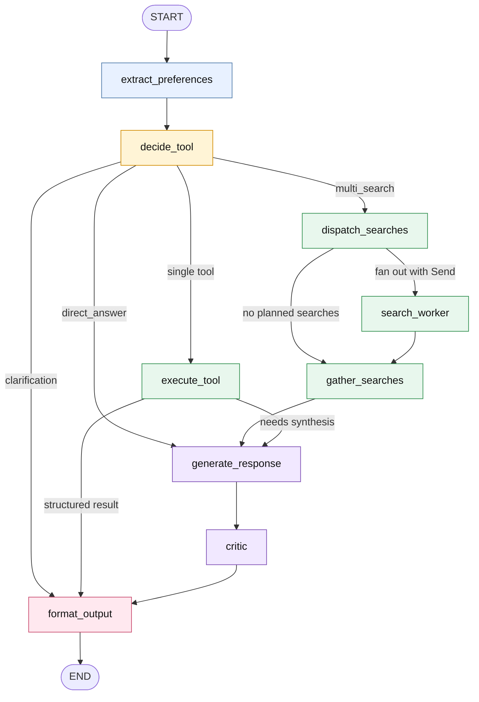

# UK Rent Recommendation System

A UK student rental recommendation application with a conversational search
interface, structured search form, LangGraph agent workflow, MCP-compatible tool
execution, persistent conversation state, and map-based amenity views.

The current runtime is packaged under `src/uk_rent_agent/`. The web layer still
loads the mature `local_data_demo` Flask routes through a compatibility wrapper
while the production entry point runs through an ASGI shell.

## Contents

- [Core Capabilities](#core-capabilities)
- [Runtime Architecture](#runtime-architecture)
- [LangGraph Agent Architecture](#langgraph-agent-architecture)
- [Search Experience](#search-experience)
- [MCP Integration](#mcp-integration)
- [Memory and Persistence](#memory-and-persistence)
- [Project Structure](#project-structure)
- [Tech Stack](#tech-stack)
- [Getting Started](#getting-started)
- [Configuration](#configuration)
- [Testing](#testing)
- [Module Notes](#module-notes)

## Core Capabilities

- Property search from OnTheMarket through an on-demand scraper and persistent
  SQLite listing cache, with optional offline demo data for development.
- Conversational search through `/api/alex` and deterministic structured search
  through `/api/search_direct`.
- Search criteria accumulation across turns: area, commute destination, no-commute
  intent, budget, bedrooms, travel-time limit, amenities, and soft preferences.
- LangGraph StateGraph workflow with deterministic intent fast paths, LLM fallback
  classification, tool execution, parallel multi-search support, response
  generation, and grounding critic.
- Tool registry exposed in-process and through a Model Context Protocol (MCP)
  stdio server.
- Conversation history, per-conversation state, favorites, local authentication,
  and optional per-user memory deletion.
- Long-term user memory backed by ChromaDB and exposed as `recall_memory` and
  `remember` tools.
- Safety, transport, nearby POI, weather, web-search, and map-generation tools.
- ASGI deployment entry point with request-correlated logging and SQLite
  LangGraph checkpoints.

## Runtime Architecture

```text
Browser UI
   |
   v
Starlette ASGI shell (uk_rent_agent.web.asgi)
   |
   v
Flask compatibility app (local_data_demo/app.py)
   |
   +-- /api/alex
   |      |
   |      v
   |   LangGraph agent (local_data_demo/core/langgraph_agent.py)
   |      |
   |      v
   |   Tool provider
   |      |-- in-process ToolRegistry
   |      +-- optional MCPToolClient -> local_data_demo/mcp_server.py
   |
   +-- /api/search_direct
          |
          v
       search_properties_impl directly, bypassing the LLM router

Shared services:
   - `src/uk_rent_agent/agent/*`: state, contracts, persistence, critic, guardrails
   - `local_data_demo/core/tools/*`: domain tools
   - `local_data_demo/core/scraping/*`: listing providers and cache
   - `local_data_demo/rag/*`: embeddings, conversation memory, area knowledge,
     and long-term user memory
   - `.runtime/*`: SQLite checkpoints, listing cache, auth store, idempotency store
```

## LangGraph Agent Architecture

The active conversational path uses `build_agent_graph()` in
`local_data_demo/core/langgraph_agent.py`. It is a compatibility graph that imports
shared state, contracts, persistence, critic, and guardrail components from
`src/uk_rent_agent/agent/`.

### Graph Flow Diagram



### Node Responsibilities

| Node | Responsibility |
|---|---|
| `extract_preferences` | Updates hard preferences, soft preferences, excluded areas, amenities, and safety concerns from the current message. |
| `decide_tool` | Chooses the next step. Deterministic paths cover memory recall, result follow-ups, property-detail questions, greetings, explicit no-commute intent, and live transport queries. Other requests fall back to LLM tool classification. |
| `execute_tool` | Runs a single selected tool through the configured provider. It injects accumulated search criteria for `search_properties`, creates idempotency keys for tool calls, and applies guardrails for write tools. |
| `dispatch_searches` | Starts the map-reduce branch for planned multi-search requests. |
| `search_worker` | Runs one planned sub-search and appends the result to the reducer-managed `search_results` state. |
| `gather_searches` | Combines multi-search observations and raw outputs into a single evidence payload. |
| `generate_response` | Uses the configured LLM to synthesize a response from the user query, context, and tool observation. |
| `critic` | Checks generated answers against the evidence surface before formatting. Unsupported monetary figures trigger one corrective regeneration pass; persistent issues receive a caveat rather than replacing the answer. |
| `format_output` | Produces the frontend-facing response shape, including search recommendations, clarification payloads, safety reports, POI lists, and commute-cost data. |

### Routing Summary

```text
START -> extract_preferences -> decide_tool

decide_tool:
  direct_answer -> generate_response
  clarification -> format_output
  multi_search -> dispatch_searches
  any other tool -> execute_tool

dispatch_searches:
  planned searches -> search_worker(s) -> gather_searches -> generate_response
  no searches -> gather_searches -> generate_response

execute_tool:
  structured search/safety/POI/commute result -> format_output
  other observations or errors -> generate_response

generate_response -> critic -> format_output -> END
```

The structured form path (`POST /api/search_direct`) is intentionally outside this
graph. It validates criteria, calls `search_properties_impl()` directly, and writes
the resulting criteria/results back into the same conversation state used by later
chat turns.

### State Shape

The shared state is defined in `src/uk_rent_agent/agent/state.py`:

```python
class AgentState(TypedDict, total=False):
    user_query: str
    user_id: str
    session_id: str
    extracted_context: dict
    user_preferences: dict
    accumulated_search_criteria: dict
    tool_decision: dict
    tool_observation: str | None
    tool_raw_data: Any | None
    search_results: list
    final_response: str
    response_type: str
    tool_data: dict
    run_id: str
    request_id: str
    context_tainted: bool
    critic_attempts: int
    verdict: dict
    memory_context: str
    plan: list
```

## Search Experience

The application supports two search paths:

| Path | Endpoint | Behavior |
|---|---|---|
| Conversational | `POST /api/alex` | Runs through the LangGraph agent. The agent can use chat history, long-term memory, current property context, and accumulated criteria before selecting tools. |
| Structured form | `POST /api/search_direct` | Validates explicit criteria and calls the property-search tool directly. This path avoids LLM routing and is intended for repeatable searches from the UI form. |

Search requires an area. Budget, bedrooms, commute destination, and maximum commute
time are optional. When the user explicitly indicates no commute, the search tool
sets `no_commute` and omits commute filtering.

The frontend keeps a criteria panel synchronized with the conversation state. If
the area is missing, the conversational path returns structured `missing_fields`
and `known_criteria` data so the UI can render a targeted clarification form.

## MCP Integration

`local_data_demo/mcp_server.py` exposes the same registered domain tools over MCP
stdio. The web process can use either:

- the in-process `ToolRegistry`, or
- `MCPToolClient`, which calls the MCP server and falls back to the in-process
  registry when the subprocess is unavailable.

Standalone MCP server:

```bash
cd local_data_demo
python mcp_server.py
```

Example external client configuration shape:

```text
mcpServers:
  uk-rent-tools:
    command: <path-to-python>
    args: [mcp_server.py]
    cwd: <repo>/local_data_demo
```

See `local_data_demo/MCP.md` for protocol details.

## Memory and Persistence

- LangGraph checkpoints are stored in SQLite through
  `src/uk_rent_agent/agent/persistence.py`. The default path is
  `.runtime/checkpoints.sqlite3`.
- Conversation metadata, messages, and favorites are persisted by
  `ConversationStore`.
- Local username/password authentication uses a JSON credential store under
  `.runtime/users.json` by default. Passwords are stored as hashes.
- Tool write operations use idempotency keys backed by
  `.runtime/idempotency.sqlite3`.
- Long-term user memory is implemented in `local_data_demo/rag/agent_memory.py`
  and stored in ChromaDB. It is namespaced by user identity and can be erased
  through the `/api/forget_me` route.

## Project Structure

```text
uk_rent_recommendation/
|-- src/uk_rent_agent/
|   |-- agent/                 # Shared state, contracts, critic, guardrails, persistence
|   |-- data/                  # Cache and repository abstractions
|   |-- domain/                # Domain schema and constants
|   |-- evals/                 # Evaluation metrics, harness, and CI gate
|   |-- llm/                   # Model routing
|   |-- tools/                 # Shared tool helpers
|   `-- web/                   # ASGI shell and Flask compatibility wrapper
|
|-- local_data_demo/
|   |-- app.py                 # Current Flask route implementation
|   |-- mcp_server.py          # MCP stdio server for domain tools
|   |-- unified-ui.html        # Web UI
|   |-- core/
|   |   |-- langgraph_agent.py # Active conversational StateGraph
|   |   |-- mcp_client.py      # MCP client with fallback registry
|   |   |-- tool_system.py     # Tool registry and execution envelope
|   |   |-- scraping/          # Listing provider integration and normalization
|   |   `-- tools/             # Domain tool implementations
|   `-- rag/                   # Property embeddings, memory, and area knowledge
|
|-- tests/                     # Legacy and integration-oriented tests
|-- tests_refactor/            # Current architecture and contract tests
|-- evals/                     # Evaluation thresholds
|-- fine_tuning/               # Optional LoRA extraction experiments
|-- map_visualization/         # Standalone Folium map tooling
|-- scrapped_data_demo/        # Legacy scraping demo
`-- pyproject.toml
```

## Tech Stack

| Area | Technologies |
|---|---|
| Web runtime | Starlette, Uvicorn, Flask, Flask-CORS |
| Agent framework | LangGraph, LangChain |
| LLM provider | DeepSeek through OpenAI-compatible APIs; optional Ollama support in legacy config |
| Tool protocol | Model Context Protocol over stdio |
| Storage | SQLite, ChromaDB |
| Embeddings and search | SentenceTransformers, FAISS |
| Listings | OnTheMarket scraper with SQLite cache; CSV fallback for development |
| Location and maps | Postcodes.io, Nominatim, OpenStreetMap Overpass, Folium |
| Transport and safety | TfL Journey Planner, optional Google Maps / OpenRouteService, police.uk |
| Frontend | HTML, CSS, JavaScript |
| Evaluation | pytest, custom retrieval/e2e metrics, CI gate |

## Getting Started

### Prerequisites

- Python 3.10 to 3.12
- DeepSeek API key for the default cloud LLM path
- Optional: Ollama if using a local LLM through the legacy configuration

### Installation

```bash
pip install -e .
```

For development tests:

```bash
pip install -e '.[dev]'
```

### Environment

Create `local_data_demo/.env`:

```env
FLASK_SECRET_KEY=replace-with-a-long-random-value

LLM_PROVIDER=deepseek
DEEPSEEK_API_KEY=your_deepseek_key
DEEPSEEK_BASE_URL=https://api.deepseek.com
DEEPSEEK_MODEL=deepseek-chat

USE_MCP_TOOLS=0
PROPERTY_SOURCE=auto
SCRAPER_SOURCES=onthemarket
SCRAPER_CACHE_TTL_HOURS=24
SCRAPE_ON_STARTUP=0

# Optional integrations
GOOGLE_MAPS_API_KEY=
OPENROUTESERVICE_API_KEY=
TFL_APP_KEY=

# Optional runtime paths and controls
CHECKPOINT_PATH=.runtime/checkpoints.sqlite3
ENABLE_CHECKPOINTER=1
AUTH_DB_PATH=.runtime/users.json
REQUIRE_AUTH=0
```

### Run

```bash
python -m uk_rent_agent.web
```

The server listens on `http://127.0.0.1:5001`.

Health check:

```bash
curl http://127.0.0.1:5001/health
```

## Configuration

Runtime configuration is read by `src/uk_rent_agent/config.py`, which loads
`local_data_demo/.env`.

| Variable | Default | Purpose |
|---|---|---|
| `FLASK_SECRET_KEY` | empty | Required by the ASGI entry point. |
| `USE_MCP_TOOLS` | `0` | Use MCP subprocess tool execution when `1`; otherwise use the in-process registry. |
| `PROPERTY_SOURCE` | `auto` | Startup dataset source: `auto`, `csv`, or `scraper`. |
| `SCRAPE_ON_STARTUP` | `0` | Allows startup scraping when enabled. |
| `SCRAPER_CACHE_TTL_HOURS` | `24` | Freshness window for scraper cache. |
| `CHECKPOINT_PATH` | `.runtime/checkpoints.sqlite3` | SQLite LangGraph checkpoint path. |
| `ENABLE_CHECKPOINTER` | `1` | Enables LangGraph checkpoints. |
| `AUTH_DB_PATH` | `.runtime/users.json` | Local credential store path. |
| `REQUIRE_AUTH` | `0` | Requires authenticated sessions for API routes when enabled. |
| `CORS_ORIGINS` | localhost origins | Comma-separated allowed frontend origins. |

## Testing

Run the current architecture tests:

```bash
python -m pytest -q
```

Apply evaluation thresholds to a generated report:

```bash
uk-rent-eval-gate report.json
```

## Module Notes

### Property Search

`local_data_demo/core/tools/search_properties.py` is the main search tool. It
resolves the target area, applies optional constraints, calls the on-demand listing
provider, enriches results when needed, and returns structured recommendations or
a targeted clarification payload.

### Scraping

`local_data_demo/core/scraping/on_demand.py` is used by live search requests.
`provider.py` handles startup dataset selection for embedding/index warm-up.
OnTheMarket is the active live source. Other provider files remain as legacy or
experimental integrations.

### RAG

The RAG layer combines property embeddings, conversation memory, and area knowledge:

| Source | Storage | Role |
|---|---|---|
| Property embeddings | FAISS | Similarity search over listing descriptions. |
| Conversation memory | ChromaDB | Recent conversation context for follow-up questions. |
| Area knowledge | ChromaDB | Neighborhood-level context. |

### Map Visualization

Map generation uses Folium and OpenStreetMap data to render static HTML files with
property markers and nearby amenities. The web API exposes map generation through
`/api/generate_map`.

### Fine Tuning

The `fine_tuning/` directory contains an optional LoRA-based extraction pipeline.
It is not required for the default runtime; current query parsing is handled by
the configured LLM and deterministic parsing helpers.

## License

Educational and research use.
