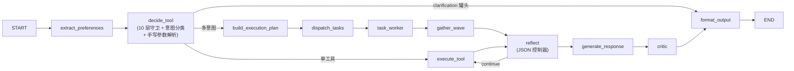
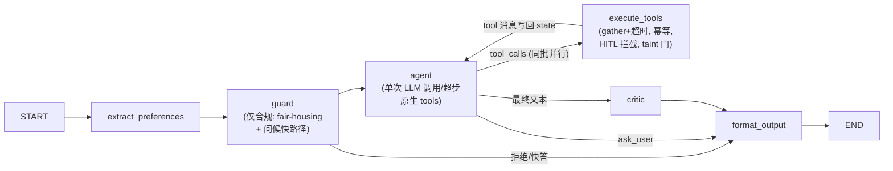

# Harness 迁移设计：从 classify-then-execute 到原生 Function-Calling 工具循环

状态：**v2.1，已批准**（2026-07-19 拍板：Phase 0 立即开工；Phase 1 待本版四处契约修订落档后开工；taint = A+；strict 维持非 strict 闭环优先。v1 评审：方向 8.5/10、实施准备度 5.5/10，5 项 P0 + 2 项契约不一致 + eval 调整，逐项见 §5）
作者：Claude + shuhan
范围：`app/core/langgraph_agent.py` 的路由/决策层重构；工具执行层、MCP 协议、前端 API 契约不变（ask_user 按 §2.5 对齐现有契约）。

---

## 1. 背景与动机

### 1.1 触发案例

用户对话（真实复现，2026-07-18）：

> 用户（上文在问 UCL 附近住哪个区域）：「距离可以远一点，可以坐地铁，火车。那些地方这样综合考虑下来性价比最高的，通勤时间不是很长但是价格适中的」
>
> Alex：「To calculate the commute cost I just need the starting property/address. Could you tell me?」

一轮暴露三个缺陷，同一根因的三个面：

| 缺陷 | 位置 | 说明 |
|---|---|---|
| 误分类 | `_majority_vote` (langgraph_agent.py:1406) | 单发意图分类被「地铁/火车/通勤」表面词带偏到 `calculate_commute_cost`；"用户还没有房源、正在选区域"这一上下文事实没有参与决策 |
| 死胡同澄清 | `_build_tool_params` (:2167) | 参数解析失败后无法改变主意（例如改调区域推荐），只能吐罐头 |
| 语言违规 | 同上 | 罐头是硬编码英文，绕过 reply_language 规则 |

注意：即使路由正确，触发案例也**回答不了**——「综合性价比排序区域」这个能力今天不存在（`recommend_areas.py:458` 只按通勤升序，无租金/预算维度）。路由重构（本设计主体）与能力补齐（§2.5b `compare_or_rank_areas`）是两个正交的工作流。

### 1.2 根因：classify-then-execute 的结构性缺陷

现状决策链 = **10 层确定性守卫 → 单发 LLM 意图分类 → 手写参数解析 → 绑定单一工具**。问题：

1. **决策点看不到全上下文**：分类器只做一次 13 选 1 的标签压缩，选完即绑定，错了没有恢复路径。
2. **补丁无限累积**：`_compute_decision` 的 0/0.1/1/1.5/1.7/2/2.4/2.5/2.6 每层守卫都是历史某次误路由的补丁；守卫间顺序耦合本身已成为 bug 来源（多条记录"placement 必须在 X 之后 Y 之前"）。
3. **失败即终点**：参数缺失 → 硬编码 clarification 字符串（7 处纯英文），而不是作为 observation 让模型重新决策。
4. **虚拟意图与真实工具错位**：catalog 里 5 个意图（`market_info`/`listing_advice`/`direct_answer`/`reasoning_property`/`multi_search`）没有对应工具，靠手写映射粘合。
5. **能力缺口暴露不出来**：分类器只能在错误选项里挑一个，缺失的能力（区域性价比比较）永远不会以「工具不存在」的形式显式失败。

### 1.3 现状与平台事实（侦察 + 评审核实，file:line 见附录 A）

- **图拓扑**：`extract_preferences → decide_tool → execute_tool ⇄ reflect → generate_response → critic → format_output`，多意图走 `build_execution_plan → dispatch/worker/gather` 波次执行；HITL 变体 `confirm_search`；递归上限 80，循环上限 `MAX_AGENT_TURNS=10`。
- **全链路没有原生 function-calling**：零处 `bind_tools`/`tools=`；只用 JSON mode + 三套手写解析器。
- **工具 schema 是 OpenAI FC 格式，但不满足 strict 前提**：`search_properties` 21 个属性，无 `required`、无 `additionalProperties:false`（`tool_system.py:112` 生成）。
- **DeepSeek strict 约束**（官方 tool_calls 指南）：需 `base_url=https://api.deepseek.com/beta`；每个 object 的**全部**属性必须进 `required` 且 `additionalProperties:false`；服务端校验 schema，不合规在请求阶段拒绝；**不支持** `minLength`/`maxLength`/`minItems`/`maxItems`；支持 enum/anyOf/$ref。
- **DeepSeek 模型迁移**：`deepseek-chat`/`deepseek-reasoner` 2026-07-24 停用；两种模式都是 `deepseek-v4-flash`，用 `extra_body={"thinking":{"type":"enabled"|"disabled"}}` 区分，**默认 enabled**。⚠️ thinking 模式下发生 tool call 后，后续轮次必须把 `reasoning_content` 传回否则 400——循环驱动必须显式 disabled（§2.9）。
- **MCP 客户端只保存工具名**（`mcp_client.py:106`），无 schema/元数据——循环无法据此绑定工具（§2.8a ToolSpec）。
- **ContextAssembler 返回拼接字符串**（`context_assembler.py:265`），不是消息数组——§2.7 是接口重构，非复用。
- **taint 策略现状**：`guardrails.py:52-53` 默认 `allow_tainted_memory=True`，tainted 上下文中 `remember` **被明确放行**——v1 写的"保留不动"与事实不符，§2.8c 作为显式决策处理。
- **关键约定**：clarification 是 `ToolResult(success=False)` 但 `data` 携带结构化 payload——observation 序列化必须保留 `.data`。
- **前端澄清契约**：`app.py:1573-1584` 读取 `missing_fields`/`missing_optional_fields`/`known_criteria`/`clarification_kind` 四个字段。
- **eval**：离线模式把 `expected_route` 预注入假 LLM（`run_benchmark.py:195-208`），测不到真实路由；LIVE 全套 < $0.02；无路由准确率指标。
- **测试基线**：以 CI 成功收集数为准（本文写作时本机收集 996，随迭代浮动）；路由强相关约 61 个，迁移必然重写。

---

## 2. 目标架构

### 2.1 一句话

把「选工具」从前置一次性分类挪进循环：**模型带完整消息历史 + 原生工具 schema，每个图超步决定一件事——调工具（同批可并行）/ 直接回答 / 调 `ask_user` 反问；工具错误与参数缺失作为 observation 回流，模型可自我纠正。** 确定性层只保留合规与安全，不再承担路由。

### 2.2 拓扑对比

**现状：**



**目标：**



### 2.3 循环 = 图节点 + state 消息通道（P0-4）

**不是**单体 Python `for` 循环。`agent` 与 `execute_tools` 是两个独立 LangGraph 节点，循环状态全部落在 `AgentState.messages`（本轮 plain channel），每个节点一个超步：

- **`agent` 节点**：恰好一次 LLM 调用（输入 `state.messages`，绑定 tools）。产出三选一：`Command(goto="execute_tools")`（把 assistant tool_calls 消息 append 进 state）、`Command(goto="critic")`（最终文本）、ask_user → `Command(goto="format_output")`。
- **`execute_tools` 节点**：取 messages 末尾的 tool_calls 批次，`asyncio.gather` 并行执行（复用 `TOOL_TIMEOUTS`/幂等键/重试语义），把 tool 结果消息 append 进 state，`Command(goto="agent")`。HITL：批次含 `search_properties` 且 HITL 开启 → **`interrupt()` 必须发生在本批任何 `asyncio.gather`/工具执行之前，整批一起 gate**。恢复时节点从头重跑，但此前未执行过任何工具，所以才是真正零重放；更早批次的结果早已随消息落在 state，不受影响（这正是必须走图节点而非单体循环的原因）。
- **循环上限**：`loop_turn` 沿用（每次进入 `agent` +1，上限 `MAX_AGENT_TURNS=10`）；到限后 `agent` 节点以"基于已有 observation 作答，不再给 tools"的降级调用收尾。
- **无进展守卫**沿用：`(tool, params_digest)` 本轮已执行 → 该 tool_call 不重放，回注 "already ran; see result above" tool 消息。

**并行 vs 串行（P0-4b）**：同一 assistant 批次内的 tool_calls 并行执行——仅适用于独立任务（safety + weather + POI）。有依赖的链（`compare_or_rank_areas` → 对入选区域 `search_properties`；`get_property_details` → 追问）天然落在**跨超步串行**：模型看到上批结果后下批再调。旧 wave executor 的 depends_on 波次语义由此被"批内并行 + 批间串行"完整覆盖，不需要显式 DAG。

**工具结果双通道**（评审补充）：原始结构化 `ToolResult.data` 完整存入 `tool_artifacts`（§2.8b，供前端卡片与 critic 使用，永不截断）；发给模型的 `ToolMessage.content` 是**派生视图**——经 `sanitize_untrusted`（untrusted 来源）、按工具类型的长度上限裁剪、`json.dumps(..., default=str)` 安全序列化，绝不把 raw `.data` 原样注入消息流。`{"success","data","error"}` 三键语义保留（`.data` 不因 `success=False` 丢弃），`need_clarification` payload 照常呈现给模型，由其转述或转 `ask_user`（§2.5a）。

### 2.4 确定性层的去留（守卫清单）

| 现守卫 | 去向 | 理由 |
|---|---|---|
| 0 fair-housing 拒绝 | **保留**，guard 节点短路 | 合规必须确定性 |
| 2 问候快路径 | **保留**（延迟优化） | 省一次带 tools 的调用 |
| 0.1 recall 关键词 | 删；memory_context 注入 context 块 | |
| 1 property focus | 删；聚焦房源记录注入 context 块 | |
| 1.5 comparative/detail/advice | 删；last_results 摘要注入 context 块，格式化 helper 降级为 context builder | |
| 1.7 market research 负守卫 | 删；「先不要搜索」写进 system 行为准则 | |
| 2.4 no-commute | 删；`no_commute` 是 schema 参数 | |
| 2.5 transport 关键词 | 删；工具 description 承担 | |
| 2.6 软门 follow-up | 删守卫；`criteria_gate_shown`/`confirmed` 由执行层回注（:2600-2601 保留），system 准则写明 confirmed 语义 | 门本体在工具内 |
| 多意图 → build_execution_plan | 删；批内并行 + 批间串行覆盖（§2.3） | |

**整体删除**：`_majority_vote`、`_INTENT_CATALOG`、`INTENT_CLASSIFICATION_PROMPT`、`_parse_intent`、`_heuristic_fallback`、`_build_tool_params`、`_resolve_target_address`/`_resolve_destination_address`（模型从 context 块自行填参；工具侧返回结构化 `missing_origin` 错误 + hint）、`REFLECT_PROMPT`/`_parse_reflect_action`、`BUILD_PLAN_PROMPT`/`_parse_plan_tasks`、7 处英文罐头、`LOOPABLE_TOOLS`/`PLANNABLE_TOOLS` 白名单。

### 2.5 新增工具

#### a) `ask_user`（终止型）——对齐前端既有契约（契约不一致 #1 的修复）

模型提供的参数（strict 可校验的主观判断部分）：

```json
{"question": str, "clarification_kind": "missing_area"|"soft_criteria"|"other",
 "missing_fields": [str], "missing_optional_fields": [str]}
```

**执行器确定性补齐**（模型永不伪造）：`known_criteria` 由 harness 从 `accumulated_search_criteria` 派生注入 `tool_data`，与今天 search_properties 软门产出同构。四个字段齐备 → `app.py:1573-1584` 的读取逻辑**零改动**。`response_type='clarification'`、条件面板高亮行为与现状一致。

#### b) `compare_or_rank_areas`（能力补齐，独立工作流，P0-3 的修复）

v1 的"直接注册 recommend_areas"作废——现实现只验证通勤上限、按通勤排序（`recommend_areas.py:458`），回答不了「性价比」。新工具定义：

- **输入**：`{"city", "destination", "max_commute_minutes", "budget_hint": {"amount", "period"}, "priorities": ["value"|"commute"|"safety"|"amenities"], "candidate_areas": [str]}`（candidate_areas 可选，缺省用 recommend_areas 的候选生成）。
- **输出（每区域）**：租金区间 + 中位数 + **样本量 + 数据新鲜度**（来自 OnTheMarket sqlite 缓存聚合；样本不足显式标注 `low_sample:true`，不臆测）、通勤分钟（复用 `core/commute.py`）、预算匹配率（缓存房源中 ≤ budget 的占比）、**可解释综合分**（各分项 0-100 + 权重来自 priorities + 总分公式随结果返回）、`sources`。
- **实现底座**：候选生成与通勤验证复用 `recommend_areas.py`；新增区域级租金聚合（sqlite 缓存查询，缓存缺失区域触发按需抓取或诚实返回 no_data）。
- **排期**：不阻塞 harness 主线（Phase 1 并行的工作流 B）；harness 未就绪前也可挂进 legacy catalog 受益。

### 2.6 工具侧参数解析

模型从 context 块直接看到候选地址（聚焦房源、last_results 各条）自行填参。`calculate_commute*` 缺起点 → 返回 `{"error_code":"missing_origin","hint":"no focused property in context; if user is choosing an area, consider compare_or_rank_areas or ask_user"}`（hint 面向模型）。

### 2.7 消息构造：ContextAssembler 接口重构（P0-5b）

现 `assemble()` 返回拼接字符串（`context_assembler.py:265`），**不能复用**。新增 `assemble_messages(...) -> list[Message]`：

```
system:  身份/能力边界 + SECURITY_DIRECTIVE + _language_directive(reply_language)
         + 行为准则(软门 confirmed 语义/先不要搜索/emoji 禁令/不臆测/zh 指代规则)
system₂: context 块 — accumulated_criteria 摘要 | 聚焦房源(focus_stack 末位) | last_results
         摘要(编号+地址+价格+通勤) | 推荐注册表索引 | memory_context
history: user/assistant 消息对（SessionStore shape 直转；clarification-wrapper 语义废弃）
user:    当前消息原文
```

token 预算裁剪逻辑（history 降轮→memory 25%→summary 20%）平移到消息粒度。旧 `assemble()` 在共存期继续服务 legacy 路径，Phase 3 删除。`_current_message`/`_recent_history_block` 剥离逻辑随之退役。

### 2.8 三个必须闭合的契约（P0-5 / 契约不一致 #2）

#### a) ToolSpec：统一工具描述契约

```python
@dataclass(frozen=True)
class ToolSpec:
    name: str; description: str; input_schema: dict   # 原始 JSON schema
    side_effect: str        # "none" | "write"
    retry_safe: bool
    version: str = "1"      # 幂等键的工具版本语义（langgraph_agent.py:2624 现依赖），不可丢
    terminal: bool = False  # ask_user
```

- `ToolRegistry.list_specs()` 从 `Tool` 直接构造；
- `mcp_server.py` 在 `list_tools()` 的 tool `annotations` 里附带 `side_effect`/`retry_safe`；`MCPToolClient` 保存完整 `inputSchema`+annotations（取代 `:106` 只存名字），缺 annotations 时从 fallback registry 补齐（registry 是单一事实源，两进程同码）；
- 循环从 `agent_tool_provider.list_specs()` 绑定工具并执行 taint/HITL 拦截判断——in-process 与 MCP 行为一致。

#### b) 多轮多工具的 raw-data 聚合（format_output）

现 `format_output` 围绕单个 `tool_decision`+`tool_raw_data`。新增 state 通道 `tool_artifacts: list[{turn, tool, raw_data}]`（per-turn plain channel），`execute_tools` 每批 append。`format_output` 聚合规则：

1. 存在 search_properties 成功 artifact → `response_type='search'`，recommendations/search_criteria/area_recommendations 取**最后一次**搜索 artifact（与现状语义一致）；
2. safety/POI/commute 卡片各取该 kind 最新 artifact，多 kind 并存时全部下发（对齐现有多 observation 路径的前端行为）；
3. ask_user artifact → clarification payload（§2.5a）；
4. 其余 → 纯文本 answer。

#### c) taint 下的 `remember` 策略（**已拍板：A+**，2026-07-19）

现状：`guardrails.py:47` 默认 `allow_tainted_memory=True`——tainted 上下文中写记忆被明确放行，v1 描述有误。拍板策略 **A+（默认拒绝、可信用户确认后放行）**：

1. **模型自主发起**的 `remember` 在 tainted 会话中默认拒绝（`allow_tainted_memory=False`）。
2. **用户本轮明确说「记住这个/记一下 X」视为授权**，执行层直接放行，不再多问一次（授权信号 = 当前用户消息，天然 untainted）。
3. 其余情况模型转 `ask_user`，**向用户展示将要保存的确切内容**。
4. **确认不由模型参数决定**：`confirmed=true` 不是放行依据。执行器在拒绝时保存 `pending_memory_write`（含 `content_digest`）；用户确认后**只重放这条被冻结的候选内容一次**（digest 校验 + 单次消费），防止模型在确认后偷换内容。

**自动记忆旁路必须同步收口**（`app.py:1537` 每轮后台 `remember_turn_async`；`agent_memory.py:272` `_extract_facts` 同时读 user 和 assistant 消息）：

- clean 会话：维持现状（user + assistant 双输入抽取）；
- tainted 会话：semantic facts **只从 user_msg 抽取**；assistant/tool output 一律不得进入 semantic/reflection 层；
- episodic 层继续保存用户原始消息（本就 untainted）。

效果：搜索后的会话不会每次弹记忆确认（自动通道静默降级为 user-only 抽取），同时外部内容对长期记忆的污染路径被真正阻断。

### 2.9 模型与 strict 策略（P0-1 / P0-2）

| 用途 | 配置 |
|---|---|
| 循环驱动（agent 节点） | `deepseek-v4-flash` + `extra_body={"thinking":{"type":"disabled"}}`（显式，默认是 enabled）+ 原生 FC。**循环内禁用 thinking**：官方约束 thinking+tool call 后续轮必须回传 `reasoning_content` 否则 400，禁用则整个问题不存在 |
| 收尾综合（可选） | 多 observation 且 `_synthesis_needs_reasoner` 判真时，最后一次**无 tools** 调用可用 `thinking:enabled`（无后续工具轮 → 无 reasoning_content 回传义务） |
| 模型名迁移 | `router.py:19-21`/`llm_config.py:22-24` 默认值 → `deepseek-v4-flash`；`ModelRouter.create()` 增加 `extra_body` thinking 参数透传（`router.py:39` 现在不传） |

**strict 分两步走**：

1. **Phase 1 用非 strict FC**（标准 endpoint）先验证闭环——现有 schema 直接可用，隔离变量；
2. **strict 启用为独立步骤**（Phase 2 内 A/B）：新增 `DeepSeekStrictSchemaAdapter`——全部属性进 `required`（原可选属性 type 加 `null` 分支，执行前剥 null 再走 pydantic 默认值）、`additionalProperties:false`、剥除 `minLength`/`maxLength`/`minItems`/`maxItems`；`base_url` 切 `/beta`；**14 个工具 schema 各一条适配后服务端可接受性校验测试**。strict 只有在 Phase 2 数据显示 schema-failure 率有改善空间时才有必要成为默认。

成本：tools schema 常驻每请求（14 个工具），Phase 1 顺手精简双语长描述（≤3 行/工具，示例移入 system 准则）；DeepSeek 前缀缓存自动命中，LIVE 全套实测 < $0.02 量级不变。

---

## 3. 迁移计划

### Phase 0 — 即时修复（与架构解耦，先行合并）

1. **模型迁移**（7-24 截止，最优先）：默认模型名改 `deepseek-v4-flash`；`ModelRouter.create()` 支持并显式传 `extra_body` thinking 参数（现有各 purpose：intent/judge/responder 低延迟档 → disabled；reasoner 档 → enabled，并核对现有非 FC 调用无 reasoning_content 回传义务——现架构无多轮 tool 调用，无风险）。
2. 7 处硬编码英文 clarification 按 `_reply_language_from_ctx` 双语化（legacy 止血）。
3. ~~注册 recommend_areas~~（作废，见 §2.5b——能力工作流独立排期）。

### Phase 1 — 并行建设（feature flag `AGENT_ARCH=fc_loop`，默认 legacy）

- `app/core/agent_loop.py`：`agent`/`execute_tools` 两节点 + `messages`/`tool_artifacts` 通道（§2.3）；非 strict FC。
- `ToolSpec` + `list_specs()`（registry/MCP 双实现，§2.8a）；`ask_user` 工具 + known_criteria 确定性补齐（§2.5a）。
- `ContextAssembler.assemble_messages()`（§2.7）。
- taint 策略按 §2.8c A+ 实现（guardrails 默认翻转 + pending_memory_write 冻结重放 + agent_memory 双输入抽取的 tainted 降级）。
- 单测：循环机制（fake FC model 脚本化 tool_calls）、`.data` 保全、无进展守卫、批内并行/批间串行、HITL interrupt 恢复不重放、taint 拦截、ask_user 契约四字段、上限兜底。
- **工作流 B（并行）**：`compare_or_rank_areas`（§2.5b），含区域租金聚合 + 评分契约测试。

### Phase 2 — 对照验证

1. **eval 改造**：
   - 离线 FC 脚本模式（`build_fake_scripts` 注入 tool_calls 序列，机制回归可离线跑）；
   - **route_accuracy 重定义**（评审采纳）：批内**集合**比较；跨轮按**偏序/允许路径集合**比较（case 增加 `allowed_tool_paths` 字段，兼容多合法恢复路径）；
   - 独立记录：forbidden-tool 率、重复调用率、loop-exhaustion 率、schema-failure 率；
   - **守卫回归集逐例硬门**：每个被删守卫的历史 bug 场景（sticky budget、先不要搜索、no-commute、软门 follow-up、zh 指代、触发案例本身）单 case 必须通过，不许被总体均值稀释。
2. **LIVE 双跑**：全 98 case × legacy vs fc_loop；通过标准：pass_rate 与 route_accuracy ≥ legacy，守卫回归集 100%，p95 延迟劣化 ≤ 20%。
3. **strict A/B**（§2.9 第 2 步）：adapter + beta endpoint，对比 schema-failure 率决定是否默认。

### Phase 3 — 切换与清理

- 默认 `AGENT_ARCH=fc_loop`，观察一轮后删 legacy（§2.4 清单 + 5 图节点 + 旧 `assemble()`）。
- 测试收编：61 个路由测试改写为"输入→工具调用序列（集合/偏序）"断言（fake FC model）；守卫顺序断言删除。总数不降。
- 文档与 memory 更新。

### 工作量估计

| 项 | 规模 | 备注 |
|---|---|---|
| Phase 0 | 小（1 会话） | 模型迁移比 v1 估计多 extra_body 透传改造 |
| Phase 1 harness | 中偏大（~800-1000 行 + 测试） | ToolSpec/assemble_messages/聚合契约是 v1 未计入的新增 |
| 工作流 B | 中（租金聚合 + 评分） | 可并行，不阻塞主线 |
| Phase 2 | 中 | eval 改造量比 v1 大（路径比较 + 4 个新指标） |
| Phase 3 | 中 | 纯清理 |

---

## 4. 风险与缓解

| 风险 | 缓解 |
|---|---|
| DeepSeek FC 中文长上下文选错工具 | 精简 schema 描述；Phase 2 route_accuracy + 守卫回归集逐例硬门；`AGENT_ARCH=legacy` 逃生门保留一个观察期；strict 作为后续增强而非前提 |
| 提示注入面扩大 | SECURITY_DIRECTIVE 常驻；模型通道工具结果一律 sanitize + 长度上限（§2.3 双通道）；写工具 taint 门执行层确定性拦截（§2.8c A+，确认不由模型参数决定） |
| HITL/checkpoint 语义破坏 | 循环即图节点 + messages 落 state（§2.3），interrupt 恢复零重放；专项单测 |
| 多跳延迟劣化 | direct answer 2→1 次调用抵消；批内并行；p95 门槛 20% |
| 软门被绕过 | `criteria_gate_shown` 执行层回注非模型控制；守卫回归集 case 化 |
| 7-24 模型停用撞迁移中途 | Phase 0 独立先行 |
| strict 启用即 4xx | adapter + 14 工具服务端可接受性测试，且 strict 永远不是闭环前提 |

---

## 5. v1 评审对照表

| 评审项 | 本版处置 |
|---|---|
| P0-1 strict 前提不满足 | §2.9：Phase 1 非 strict 先行；strict 独立步骤 = adapter（all-required+null 分支+剥不支持关键词）+ beta endpoint + 14 工具校验测试 |
| P0-2 模型迁移 ≠ 改名 | §2.9/Phase 0-1：`extra_body` thinking 透传；循环强制 disabled（另查明 reasoning_content 回传 400 约束，作为循环禁 thinking 的硬理由） |
| P0-3 recommend_areas 不解决触发案例 | §2.5b：`compare_or_rank_areas` 全新能力契约（租金中位数/样本量/新鲜度/预算匹配率/可解释综合分/sources）；Phase 0 注册项作废 |
| P0-4 单体 for 循环 | §2.3：agent/execute_tools 独立节点 + messages 落 state，interrupt 零重放；批内并行 + 批间串行覆盖依赖链 |
| P0-5a MCP 只存工具名 | §2.8a ToolSpec + annotations + fallback 补齐 |
| P0-5b ContextAssembler 是字符串 | §2.7 显式接口重构 `assemble_messages()`，旧接口共存期保留 |
| P0-5c format_output 单决策假设 | §2.8b `tool_artifacts` 聚合契约（最后一次搜索优先 + 分 kind 取最新） |
| 契约 #1 ask_user 缺前端字段 | §2.5a：模型提供 `question`/`clarification_kind`/`missing_fields`/`missing_optional_fields` 四字段 + 执行器确定性补 `known_criteria`，app.py:1573-1584 零改动 |
| 契约 #2 taint remember 与事实不符 | §2.8c 已拍板 A+：默认拒绝 + 用户明示授权直通 + pending_memory_write 冻结重放（确认不由模型参数决定）+ 自动记忆旁路 tainted 降级为 user-only 抽取 |
| eval route_accuracy 过严 | Phase 2：批内集合、跨轮偏序/允许路径、4 个独立失败指标、守卫回归集逐例硬门 |

---

## 附录 A：关键锚点

- 守卫表 `langgraph_agent.py:1143-1289`；分类器 `:1406-1472`；参数解析 `:2119-2203`；reflect `:2949-3048`；波次执行 `:3331-3470`；图构建 `:3478-3585`；criteria 回注 `:2600-2601`。
- 工具注册 `tool_system.py:462-499`；schema 生成 `:112`；`to_openai_format` `:317`；ToolResult 语义 `:139-224`。
- MCP 客户端 `mcp_client.py:106`（只存名）、回退 `:158-221`；server 广告 schema `mcp_server.py:65`。
- ContextAssembler `context_assembler.py:265`；guardrails taint 放行 `guardrails.py:47-54`；前端澄清契约 `app.py:1573-1584`；recommend_areas 排序 `recommend_areas.py:458`。
- eval 路由注入 `run_benchmark.py:195-208`；判分门 `graders.py:1274-1279`；基线 996 tests。
- DeepSeek 官方：strict 约束（tool_calls 指南）、thinking `extra_body` 与 `reasoning_content` 回传义务（thinking_mode 指南，v4-pro 页，flash 行为待 Phase 0 实测确认）、模型名 7-24 停用（pricing 页）。
